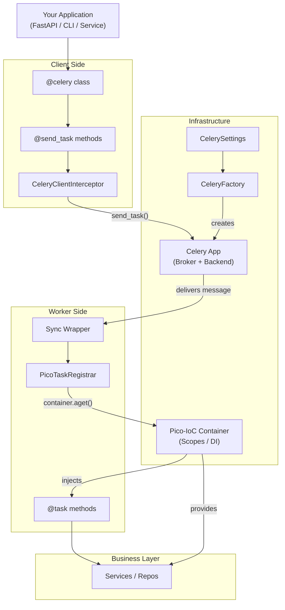
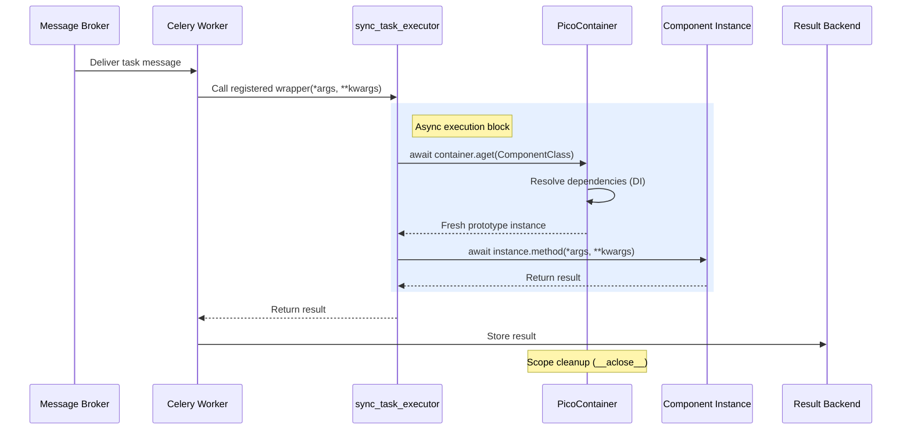
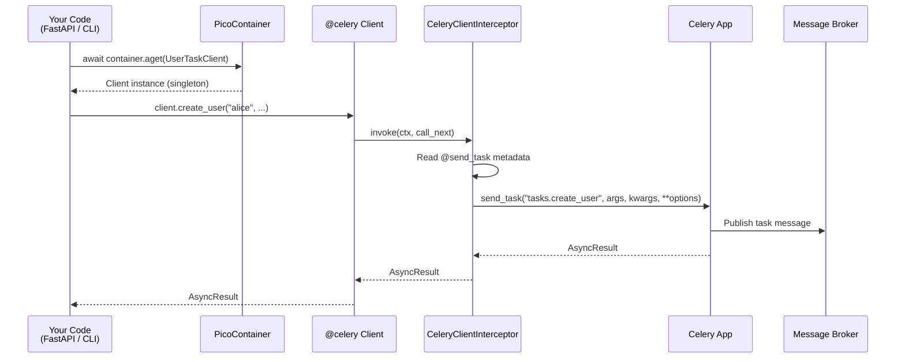
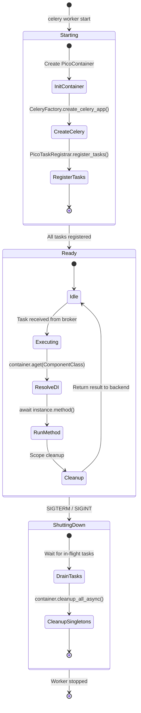

# Architecture Overview -- pico-celery

`pico-celery` is an integration layer that connects **Pico-IoC**'s inversion-of-control container with **Celery 5** background task execution.

It is a **dual-purpose** library:

1. **Worker-Side:** Ensures task handlers (`@task`) are resolved and executed through the IoC container.
2. **Client-Side:** Provides declarative, injectable clients (`@celery`, `@send_task`) for sending tasks without tight coupling to the Celery app.

Its purpose is not to replace Celery -- but to treat task execution and task sending as **IoC-managed dependencies**.

---

## 1. High-Level Design

The library integrates Celery as a transport layer, managed by Pico-IoC.

### Client-Server Architecture



---

## 2. Architectural Comparison

This section contrasts the `pico-celery` design with the standard approach to using Celery.

| Aspect                    | Standard Celery Architecture                                                                                                                                                  | `pico-celery` Architecture                                                                                                                                                               |
| :------------------------ | :---------------------------------------------------------------------------------------------------------------------------------------------------------------------------- | :--------------------------------------------------------------------------------------------------------------------------------------------------------------------------------------- |
| **Task Definition**       | **Global Functions.** Tasks are defined at the module level using `@app.task`.                                                                                                | **Component Methods.** Tasks are `async` methods inside `@component` classes.                                                                                                            |
| **Dependency Injection**  | **Manual or None.** Dependencies (like services or DB sessions) must be imported globally, passed manually, or managed via context patching.                                  | **Constructor Injection.** Dependencies are declared in the component's `__init__` and provided automatically by Pico-IoC on every task.                                                 |
| **State & Scoping**       | **Shared Global State.** The task function runs in the module's scope, making it easy to accidentally share state between tasks, leading to concurrency issues.               | **Isolated `prototype` Scope.** Each task execution gets a *brand new instance* of the component, guaranteeing total state isolation.                                                    |
| **Task Sending (Client)** | **Imperative & Coupled.** You must import the `celery_app` instance and manually call `celery_app.send_task("task_name", ...)`. This couples your services to the Celery app. | **Declarative & Decoupled.** You inject an abstract client (`@celery`) and call a method (`@send_task`). An interceptor handles the `send_task` call, decoupling your logic from Celery. |
| **Async Model**           | **Sync-first.** While Celery supports async, it often requires manual `asyncio.run()` wrappers inside sync tasks, which is inefficient and complex.                           | **Async-Native.** The `PicoTaskRegistrar` generates a true `async def` wrapper, allowing tasks to be async from top to bottom and use an `eventlet`/`gevent` pool naturally.             |
| **Testability**           | **Difficult.** Requires mocking the global `app`, patching global dependencies, or running an in-process worker.                                                              | **Simple.** You can unit-test the task component class directly (just `await container.aget(MyTaskComponent)`) by mocking its constructor dependencies.                                  |

---

## 3. Worker: Task Execution Flow

This flow describes what happens *inside a Celery worker* when a task is received.

### Task Registration and Execution Flow



---

## 4. Client: Task Sending Flow

This flow describes what happens *in your web app* (or other service) when you call a client method.



---

## 5. Client: Declarative Model (`@send_task`)

Instead of manually calling `celery_app.send_task("name", ...)`, `pico-celery` provides a declarative client model.

* You define a class inheriting from `CeleryClient` (a `Protocol`).
* You decorate the class with `@celery`.
* You define methods with signatures matching the task.
* You decorate the methods with `@send_task(name=...)`.

This model uses a **`MethodInterceptor`** from `pico-ioc`.

```python
from pico_celery import celery, send_task, CeleryClient

@celery
class UserTaskClient(CeleryClient):

    @send_task(name="tasks.create_user", queue="high_priority")
    def create_user(self, username: str, email: str):
        pass
```

The `CeleryClientInterceptor` is automatically registered and injected with the `Celery` app. When `create_user(...)` is called, the interceptor:

1. Catches the call.
2. Extracts the task name and options.
3. Packages the arguments.
4. Calls `celery_app.send_task(...)`.

This decouples your services from the Celery app instance and task name strings.

---

## 6. Worker: Task Model (`@task`)

* Tasks are **async methods** inside `@component` classes.
* They declare dependencies via constructor injection.
* They are marked with the `@task` decorator.

```python
@component(scope="prototype")
class UserTasks:
    def __init__(self, service: UserService):
        self.service = service

    @task(name="tasks.create_user")
    async def create_user(self, username: str):
        return await self.service.create_user(username)
```

No global functions. No shared state. Everything goes through IoC.

---

## 7. Worker: Task Registration Strategy

At startup (inside the worker process):

1. `PicoTaskRegistrar` is initialized.
2. It scans all IoC-managed components for methods decorated with `@task`.
3. For each `@task` method, it extracts metadata.
4. It generates a dynamic **async wrapper** function.

```python
async def generated_task_wrapper(*args, **kwargs):
    component_instance = await container.aget(ComponentClass)
    method = getattr(component_instance, "method_name")
    return await method(*args, **kwargs)
```

5. This wrapper is registered on the Celery app:
   `celery_app.task(name=task_name, **options)(generated_task_wrapper)`

This ensures **no Celery task ever executes without IoC resolution**.

---

## 8. Worker: Async Execution Model

`pico-celery` **only supports async handlers**.

* The worker must use an async-capable pool (`eventlet`, `gevent`).
* The `PicoTaskRegistrar` generates a real `async def` wrapper.
* Component lifetimes follow IoC scoping rules.
* Side effects can be `await`ed naturally.

No thread pools, no `asyncio.run()`, no blocking I/O.

---

## 9. Worker: Scoping Model

Because tasks run outside HTTP/WebSocket lifecycles, scoping is explicit.

Recommended scopes:

| Scope       | Use Case                               | Behaviour                             |
| :---------- | :------------------------------------- | :------------------------------------ |
| `singleton` | Shared infra (DB pools, cache clients) | Created once per worker process       |
| `prototype` | **Default for task components**        | **Fresh instance per task execution** |
| `custom`    | Specialized lifetimes                  | IoC-managed                           |

`prototype` is ideal for task components because:

* Tasks should never share state.
* Every execution gets a new, clean component instance.
* Concurrency is safe and isolated.

---

## 10. Worker: Cleanup & Lifecycle

Celery workers do not have a natural async request/response lifecycle.
`pico-celery` bridges this by relying on Pico-IoC's scoping.

* Each task execution in `prototype` scope triggers:

  * IoC resolution (`aget`)
  * Async cleanup (`__aclose__`) when the scope is disposed
* When the worker shuts down:

  * `container.cleanup_all_async()` is called
  * Singletons are closed cleanly (e.g., DB pools)

This prevents resource leaks.

### Worker Lifecycle



---

## 11. Architectural Intent

**`pico-celery` exists to:**

* Bring constructor-based DI to Celery workers.
* Provide declarative, injectable clients for sending tasks.
* Allow services, repos, and domain logic to be reused across layers.
* Keep task handlers lightweight and framework-free.
* Support clean architecture (Celery → transport, IoC → composition).

It does *not* attempt to:

* Replace Celery configuration.
* Modify Celery’s routing or scheduling.
* Provide orchestration or pipelines.

---

## 12. When to Use

Use **pico-celery** if you need:

✔ Consistent DI across web, CLI, and workers
✔ Clean separation between transport and logic
✔ Declarative task clients
✔ Isolated task handlers
✔ Testable and mockable dependencies

Avoid it if your app:

✖ Uses only standalone function tasks
✖ Doesn’t use Pico-IoC
✖ Must run strictly synchronous

---

## 13. Summary

`pico-celery` is a **structural integration tool**:

It lets Celery focus on *distributed execution* while **Pico-IoC** owns *composition, lifecycle, and dependency management* — for both sending and executing tasks.

> Celery stays transport.
> Container stays in control.
> Task handlers and clients stay pure and async.

