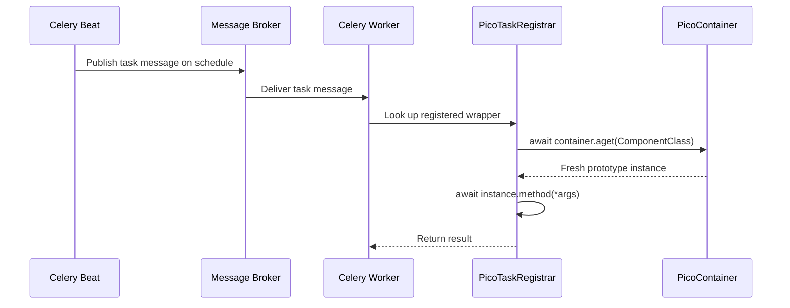

# How to Set Up Periodic / Scheduled Tasks

This guide explains how to configure periodic (cron-like) task execution with pico-celery using Celery Beat.

## Overview

pico-celery handles task **definition** and **registration** through `@task` and `PicoTaskRegistrar`. Periodic scheduling is handled by **Celery Beat**, Celery's built-in scheduler. The two work together: you define tasks with pico-celery, then configure Beat to invoke them on a schedule.

## Step 1: Define the Task

Create a regular pico-celery worker task:

```python
from pico_ioc import component
from pico_celery import task

@component(scope="prototype")
class ReportTasks:
    def __init__(self, report_service: ReportService):
        self.report_service = report_service

    @task(name="tasks.generate_daily_report")
    async def generate_daily_report(self):
        await self.report_service.generate_and_send()

    @task(name="tasks.cleanup_old_data")
    async def cleanup_old_data(self, days: int = 30):
        await self.report_service.cleanup(older_than_days=days)
```

## Step 2: Configure Celery Beat Schedule

Add the beat schedule to your Celery configuration. You can do this through pico-ioc configuration or directly on the Celery app.

### Option A: Via a Custom Factory

Extend `CeleryFactory` or add post-configuration:

```python
from celery import Celery
from celery.schedules import crontab
from pico_ioc import component, configure

@component
class BeatConfigurator:
    def __init__(self, celery_app: Celery):
        self._app = celery_app

    @configure
    def setup_beat(self):
        self._app.conf.beat_schedule = {
            "daily-report": {
                "task": "tasks.generate_daily_report",
                "schedule": crontab(hour=8, minute=0),  # every day at 08:00
            },
            "weekly-cleanup": {
                "task": "tasks.cleanup_old_data",
                "schedule": crontab(
                    hour=2, minute=0, day_of_week="sunday"
                ),
                "args": (90,),  # clean data older than 90 days
            },
        }
```

### Option B: Via Celery Configuration File

Create a `celeryconfig.py` and reference it:

```python
from celery.schedules import crontab

beat_schedule = {
    "daily-report": {
        "task": "tasks.generate_daily_report",
        "schedule": crontab(hour=8, minute=0),
    },
    "hourly-sync": {
        "task": "tasks.sync_data",
        "schedule": 3600.0,  # every 3600 seconds (1 hour)
    },
}

timezone = "UTC"
```

## Step 3: Run the Beat Scheduler

Start Celery Beat alongside your worker:

```bash
# Run worker and beat in separate processes
celery -A myapp worker --loglevel=info -P eventlet
celery -A myapp beat --loglevel=info

# Or run both in a single process (development only)
celery -A myapp worker --beat --loglevel=info -P eventlet
```

## Common Schedule Patterns

| Pattern                    | Celery Schedule Expression                              |
| :------------------------- | :------------------------------------------------------ |
| Every 30 seconds           | `30.0`                                                  |
| Every 5 minutes            | `300.0` or `crontab(minute="*/5")`                      |
| Every hour                 | `3600.0` or `crontab(minute=0)`                         |
| Daily at midnight          | `crontab(hour=0, minute=0)`                             |
| Weekdays at 9 AM           | `crontab(hour=9, minute=0, day_of_week="1-5")`          |
| First day of month at noon | `crontab(hour=12, minute=0, day_of_month=1)`            |
| Every Sunday at 2 AM       | `crontab(hour=2, minute=0, day_of_week="sunday")`       |

## Using a Database-Backed Schedule

For dynamic schedules that can be changed at runtime, use `django-celery-beat` or `celery-redbeat`:

```bash
pip install celery-redbeat
```

```python
@component
class BeatConfigurator:
    def __init__(self, celery_app: Celery):
        self._app = celery_app

    @configure
    def setup_beat(self):
        self._app.conf.update(
            beat_scheduler="redbeat.RedBeatScheduler",
            redbeat_redis_url="redis://localhost:6379/2",
        )
```

## Passing Arguments to Periodic Tasks

Use `args` and `kwargs` in the beat schedule entry:

```python
beat_schedule = {
    "cleanup-90-days": {
        "task": "tasks.cleanup_old_data",
        "schedule": crontab(hour=3, minute=0),
        "args": (90,),
        "kwargs": {},
    },
}
```

## Task Execution Flow for Periodic Tasks



!!! tip
    Periodic tasks follow the exact same execution path as manually sent tasks. The only difference is that Celery Beat acts as the sender instead of your application code.
